# Store Theme Shopstar

shopstar-vtexio es un clon de la tienda shopstar realizada con Vtex IO.

[https://shopstar.pe](https://shopstar.pe) fue la tienda elegida para realizar el clon de este proyecto, teniendo en cuenta un diseño responsive es decir las distintas dimensiones de las pantallas, tanto en mobile como en desktop.

## Galería de imágenes 

### Versión Desktop

#### Page Home

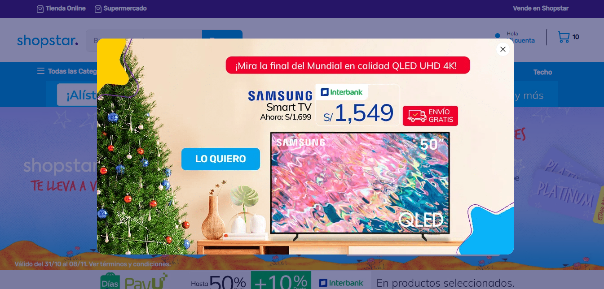
#### Seccion Footer

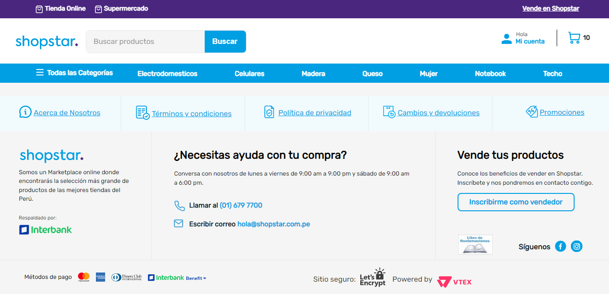

#### Page Search Result

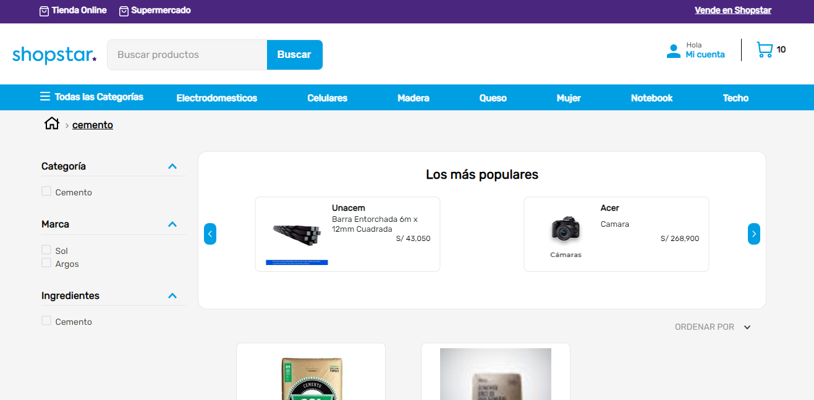

#### Page Detail Product

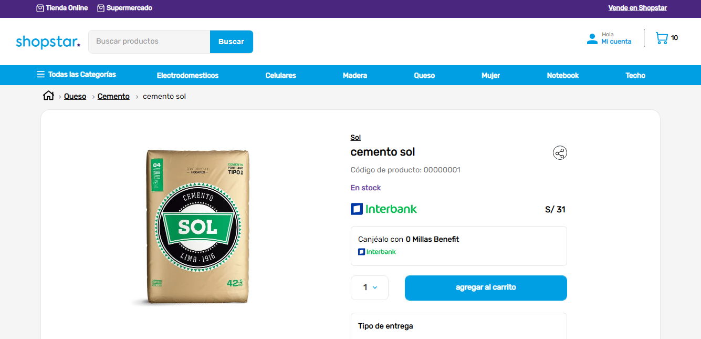
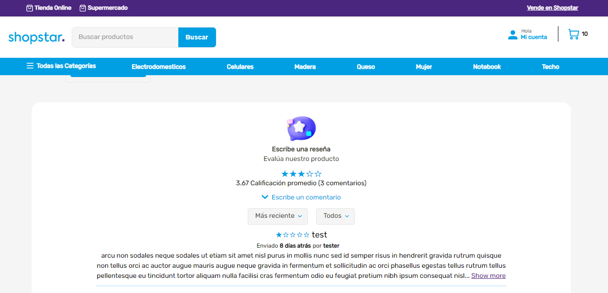

#### Custom Pages About Us

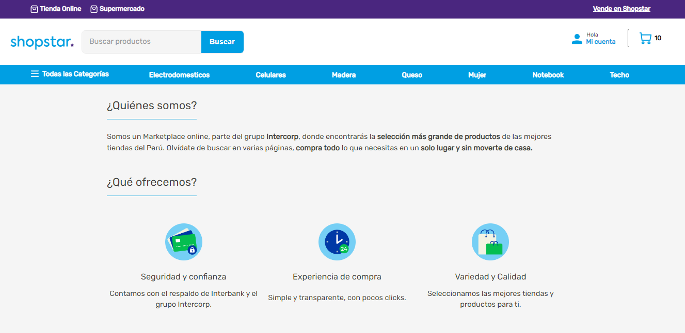

#### Custom Pages Terms and Conditions

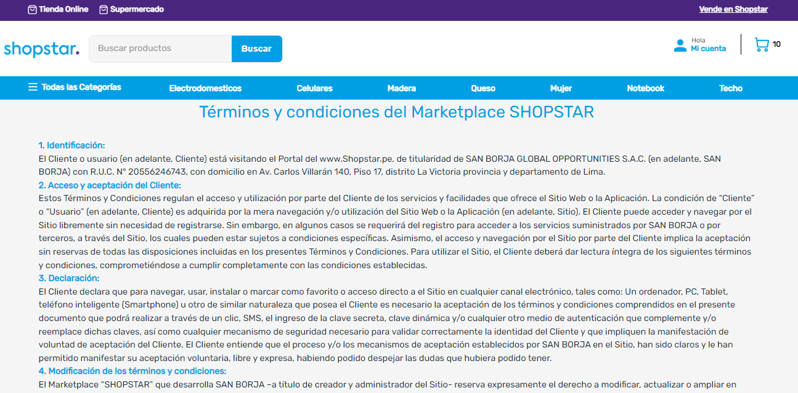

#### Custom Pages Returns and Exchanges

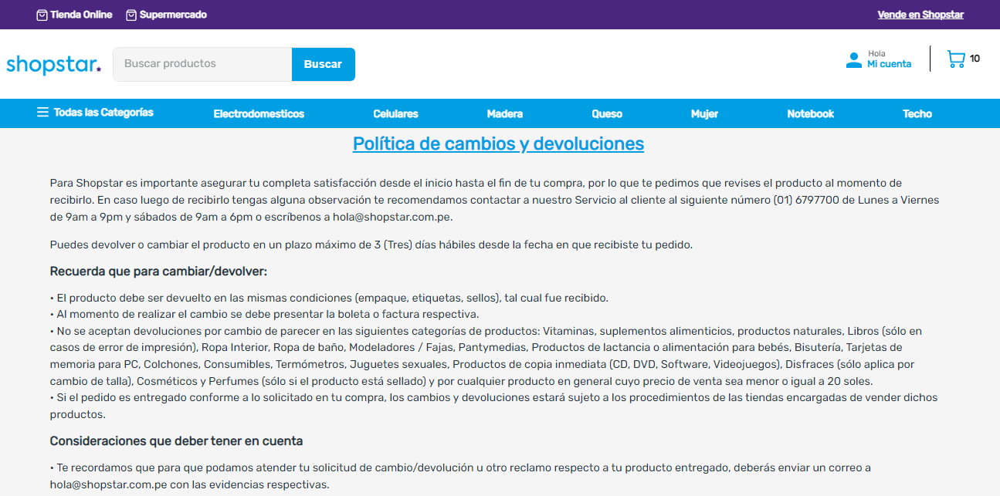
### Versión Mobile

#### Page Home

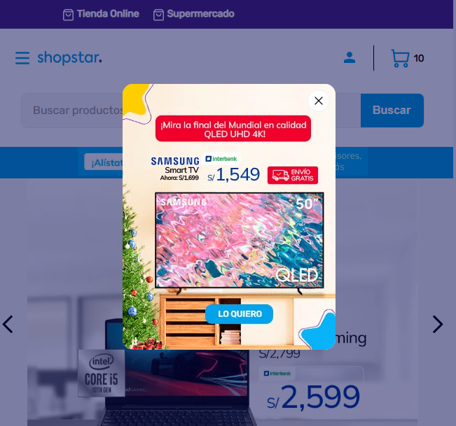
#### Seccion Footer

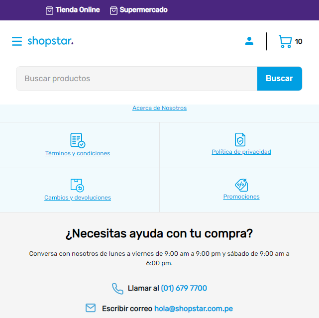

#### Page Detail Product

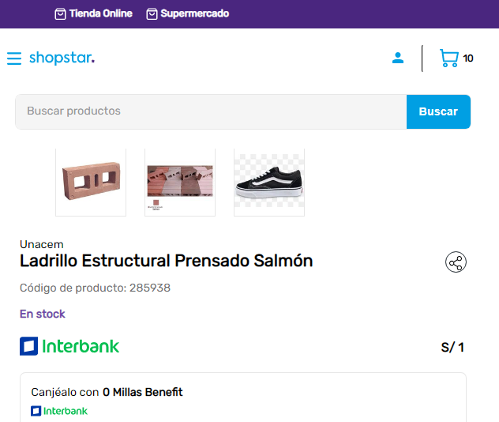

### Custom Components

#### Custom Countdown


#### Categories Diagramation
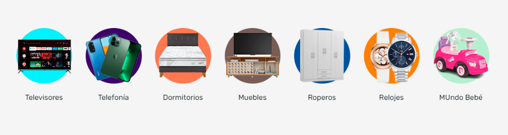
#### Custom Login
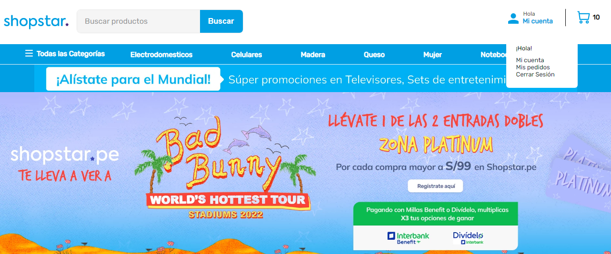
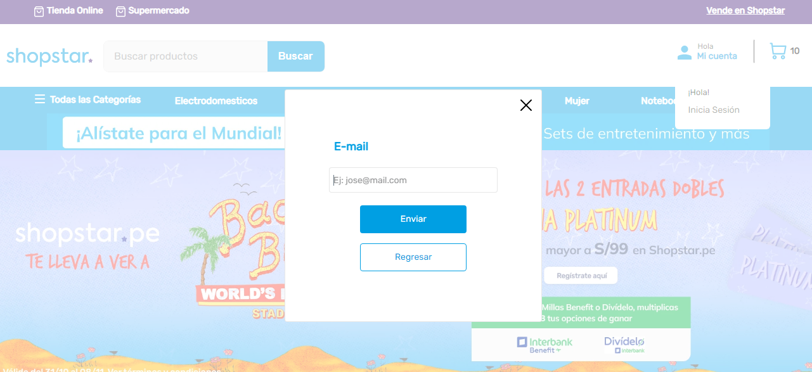

## Configuración
### Paso 1 - Configuración básica

Ingrese a la [guía de configuración básica](https://vtex.io/docs/getting-started/build-stores-with-store-framework/1) de VTEX IO y siga los siguientes pasos indicados.

Al final de la configuración, debe tener instalada la interfaz de línea de comandos de VTEX (Toolbelt) junto con un espacio de trabajo de desarrollador en el que puede trabajar.

### Paso 2 - Clonación del repositorio

Realice la [clonación](https://github.com/cristhian-fernandez/shopstar-vtexio) de este repositorio en sus archivos locales para poder comenzar a trabajar en él de manera  efectiva. 

Después, acceda al directorio del repositorio usando su terminal.


### Paso 3 - Editar el Manifest.json

Ingrese en el archivo `manifest.json` y reemplace los valores de `vendor`(nombre de la cuenta en la que está trabajando) y `name`(nombre que desee para su tema). Por ejemplo: 

```json
{
   "vendor": "itgloberspartnercl",
   "name": "shopstar-vtexio"
}
```
### Paso 4 - Instalar apps necesarias

Para usar el Store Framework y trabajar en el tema de su tienda determinada, es necesario tener instalados `vtex.store-sitemap` y `vtex.store`.

Podrá ejecutar el comando `vtex list` y verificar si esas aplicaciones ya están instaladas, en su defecto, si no lo están, ejecute el comando: `vtex install vtex.store-sitemap vtex.store -f` para instarlos respectivamente.

### Paso 5 - Desinstalar el store-theme predeterminado

Al ejecutar `vtex list`, puede verificar si algún tema está instalado.

Es común tener ya instalado un `vtex.store-theme` cuando inicia el proceso de desarrollo frontal de la tienda.

Por lo tanto, si lo encuentra en la lista de aplicaciones, copie su nombre y utilícelo junto con el comando `vtex uninstall`. Por ejemplo:

```json
vtex uninstall vtex.store-theme
```

### Paso 6 - Revisar las dependencias y builders necesarios

Una vez modificada esa sección del `manifest.json`, se debe rectificar que el repositorio contenga las siguientes dependencias y los builders necesarios:
### Builders 

```
{
    "styles": "2.x",
    "store": "0.x",
    "docs": "0.x",
    "assets": "0.x"
}
```

###  Dependencies

```
{
    "vtex.store": "2.x",
    "vtex.store-header": "2.x",
    "vtex.product-summary": "2.x",
    "vtex.store-footer": "2.x",
    "vtex.store-components": "3.x",
    "vtex.styleguide": "9.x",
    "vtex.slider": "0.x",
    "vtex.carousel": "2.x",
    "vtex.shelf": "1.x",
    "vtex.menu": "2.x",
    "vtex.minicart": "2.x",
    "vtex.product-details": "1.x",
    "vtex.product-kit": "1.x",
    "vtex.search-result": "3.x",
    "vtex.login": "2.x",
    "vtex.my-account": "1.x",
    "vtex.flex-layout": "0.x",
    "vtex.rich-text": "0.x",
    "vtex.store-drawer": "0.x",
    "vtex.locale-switcher": "0.x",
    "vtex.product-quantity": "1.x",
    "vtex.product-identifier": "0.x",
    "vtex.product-specification-badges": "0.x",
    "vtex.product-review-interfaces": "1.x",
    "vtex.telemarketing": "2.x",
    "vtex.order-placed": "2.x",
    "vtex.stack-layout": "0.x",
    "vtex.tab-layout": "0.x",
    "vtex.responsive-layout": "0.x",
    "vtex.slider-layout": "0.x",
    "vtex.iframe": "0.x",
    "vtex.breadcrumb": "1.x",
    "vtex.sticky-layout": "0.x",
    "vtex.add-to-cart-button": "0.x",
    "vtex.store-link": "0.x",
    "vtex.store-icons": "0.x",
    "vtex.store-image": "0.x",
    "vtex.modal-layout": "0.x",
    "vtex.overlay-layout": "0.x",
    "vtex.search": "2.x",
    "vtex.product-list": "0.x",
    "vtex.checkout-summary": "0.x",
    "vtex.disclosure-layout": "1.x",
    "vtex.product-price": "1.x",
    "vtex.category-menu": "2.x",
    "vtex.product-availability": "0.x",
    "vtex.shop-review-interfaces": "0.x"
}
```
### PeerDependencies

```
{
  "vtex.mega-menu": "2.x"
}
```

### Custom Apps

```
{
    "itgloberspartnercl.countdown": "0.x",
    "itgloberspartnercl.custom-login": "0.x",
    "itgloberspartnercl.categories-diagramation": "0.x"
}
```


### Paso 7 - Ejecute un preview de la tienda

Después de realizar los pasos anteriores, es momento de cargar los cambios que realizó en sus archivos locales ejecutando el comando `vtex link`. 

Si el proceso se lleva a cabo correctamente deberá ver en su terminal el siguiente mensaje: `App linked successfully`. Luego, ejecute el comando `vtex browse` para abrir una ventana del navegador que tenga su tienda vinculada.

Esto permitirá ver los cambios aplicados en tiempo real, a través de la cuenta y el espacio de trabajo en el que está trabajando.

## Contributors
1. Cristhian Javier Fernández Cumbia